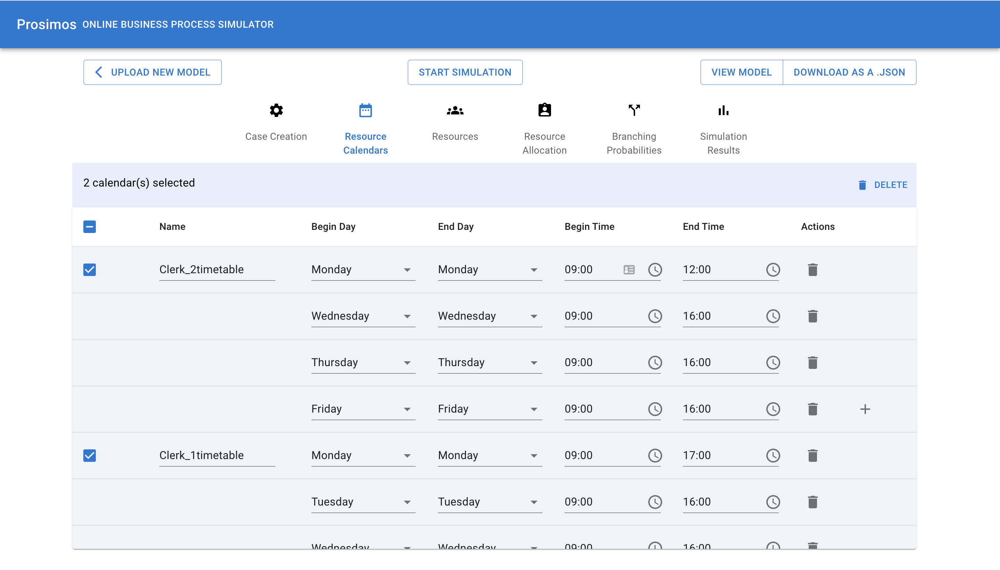
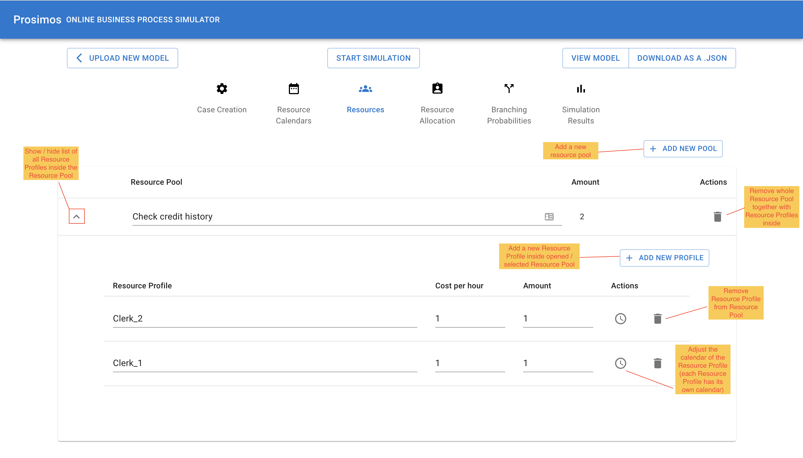
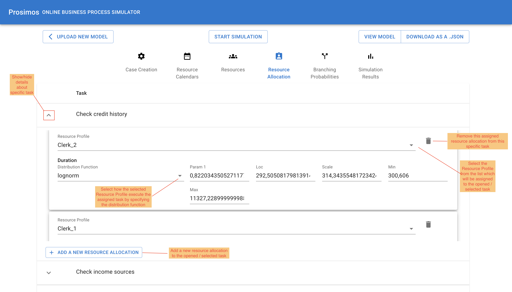

## Prosimos User Manual

The Prosimos' landing page (https://prosimos.cloud.ut.ee/) consists of two main parts:

1) Defining the **Process Model**. Here, user needs to download the BPMN model that will be used for the discovery / simulation. Allowed file formats: .bpmn. Currently supported BPMN elements:
- Task
- Events:
    - Start
    - End
- Gateways:
    - Exclusive
    - Inclusive
    - Parallel

2) Defining the **Simulation Scenario**. This part defines the parameters that needs to be completely entered in order to simulate the model. The tool provides three options on how those simulation scenario parameters can be filled in:

    - *Create a simulation scenario manually.* User will be redirected to the page with the empty template for the simulation scenario. After that, the user needs to enter all required information in order to proceed with the simulation.
    - *Upload a simulation scenario.* In case the user has already used the tool, there is an option to save the filled-in template and re-use it in the future. This option is designed exactly for this use case: when the user already has pre saved template of the simulation scenario in .json format. 
    - *Discover a simulation scenario from the log.* Here, the user can provide the log file (e.g., in .xes format) and the tool discovers the simulation parameters for the user. 

After selecting the process model and way of filling in the simulation scenario parameters, the user is redirected to the page where they can view and modify different sections of scenario parameters. 

The top toolbar contains multiple buttons:

- *Upload new model* redirects you to the previous page (landing page) where you can select a new model and simulation scenario option.
- *Start Simulation* starts the simulation and automatically redirects the user to the `Simulation Results` section. 
- *View Model* opens up the visualization of the model user selected.
- *Download as a .json* will download all current parameters (first 5 sections UI-wise) of the simulation scenario.

The main parts of the Simulation Scenario page are:

1. simulation parameters which are divided into 5 sections:

    - *Case Creation*
    - *Resource Calendars*
    - *Resources*
    - *Resource Allocation*
    - *Branching Probabilities*

    and 

2. *Simulation Results* which will be populated once you click *Start Simulation* button

Detailed description of every section of the simulation parameters:

1. *Case Creation* describes when (arrival time calendar) and how (arrival time distribution) new process cases can be started. 

    Inter arrival time is defined by the probability distribution function. Right now, available functions include: fix, norm, expon, exponnorm, gamma, triang, uniform, lognorm. Once you select one of them, the number of filled-in parameters will change. We are using statistical functions from the SciPy's subpackage `scipy.stats`. In case user needs to get the meaning of the parameters, one should consult [official documentation](https://docs.scipy.org/doc/scipy/reference/stats.html#module-scipy.stats). Examples based on multiple functions:

    - *norm*
        - Loc: the mean
        - Scale: the standard deviation
        - Min: the lower bound
        - Max: the upper bound

    - *gamma* 
        - Param 1: shape parameter (`a`)
            - if `a = 1`, it becomes exponential distribution
        - Loc: location parameter, shift by the x-axis
        - Scale: scale parameter (`θ`).
        - Min: the lower bound
        - Max: the upper bound
    
    - *triang*
        - Param 1: shape parameter (`c`)
            - `0 ≤ c ≥ 1`
        - Loc: shifts the start to `loc`
        - Scale: changes the width from 1 to `scale`
        - Min: the lower bound
        - Max: the upper bound

    > `Min` and `Max` boundaries are not part of `scipy.stats` functions and were introduced additionally. They allow users to discard all values generated outside of the defined range.

2. *Resource Calendars* lists the time intervals in which a resource is available to perform a task on a weekly calendar basis.

    This section defines calendars which then (in the next section) could be re-used. Defining a calendar here and not assigning it to the resource will not impact the simulation.

    Each calendar includes name and at least one time period. The user cannot save one instance of the calendar with no time periods in it. 

    The user is allowed to:
    1. create calendars: *Add new calendar* button
    2. modify calendars. Editing the time periods itself (begin and end time, begin and end time) and the number of assigned time periods by *+* and *delete* button in the last column.
    3. delete calendars. Select one or multiple calendars by using the checkbox in the first column, after that click *Delete* button in the right upper corner. 

    

3. *Resources* describes the resources grouped into pools. Specifically, it includes a set of resource pools.

    Description of the available functionality could be found here:

    

    Adding a new Resource Profile under the Resource Pool and not allocating the Resource Profile to the task in the next section will not impact the simulation. In order for the changes to be considered, the Resource Profile needs to be allocated to the task.

4. *Resource Allocation* maps each task in the process model and the list of resources that can perform it.
    
    Description of the available functionality could be found here:

    
    

5. *Branching Probabilities* represents the probability for the process execution to move towards any outgoing flow of each split (inclusive or exclusive) gateway in the process model.

    The UI shows all gateways in the model and their outgoing flows. The sum of provided flows should be equal to 1 for every gateway.

Description of the .json file that contains all this information could be found [here](https://github.com/AutomatedProcessImprovement/Prosimos#simulation-input-file-formats).

After simulating the process (*Start Simulation button*), the user will be redirected to the `Simulation Results` page. 

The simulation generates two output files which could be downloaded in the right upper part: 
- file with the statistics/metrics after running the simulations (*Download Stats* button)
- event-log of the simulation (*Download Logs*)

Additionally, statistics/metrics are being visualized to the user. It includes three main sections:

1. `Scenario Statistics` includes multiple key performance indicators and their Min, Avg and Max values, together with Trace Occurences.

2. `Individual Task Statistics` describes the statistics per task. They include Waiting Time, Processing Time, Cycle Time, Cost and Idle Processing Time and Idle Cycle Time where idle means including the time when resources already started the work but went resting. 

3. `Resource Utilization` section defines resource utilization, the ratio of the available time of a resource spent executing process activities.

After inspecting the received results, the user can freely go to any section of the simulation parameters, change something and run the simulation one more time. This way the user can perform a what-if analysis.